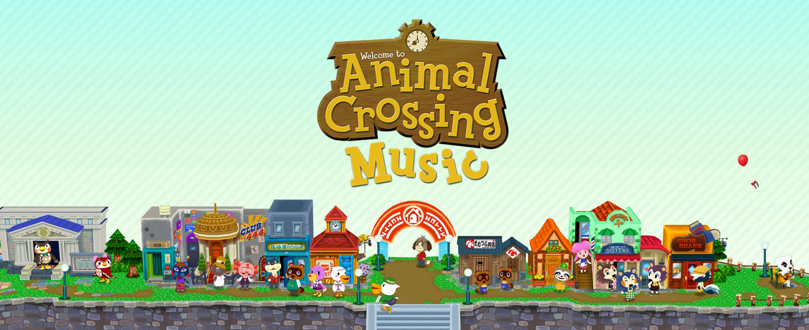

# Animal Crossing Music 🍀

**Animal Crossing Music** is a fun Chrome extension for playing Animal Crossing's music in the browser, while you work, play or browse the web! ✨

The music updates in real-time on the hour, and informs you via an optional desktop notification and customizable town tune! 🌱

## Features
### Hourly Music 🕒
Listen to the corresponding hourly music from the main Animal Crossing titles:
  - Animal Crossing
  - Wild World / City Folk
  - New Leaf
  - New Horizons

'Raining' and 'snowing' variants are also included!

### Live Weather 🌧
You can enable the "Live Weather" function so weather variants of the hourly music can be automatically picked according to the weather in your specified location!

### K.K. Slider 🎙
Listen to K.K. Slider's songs! The extension features both 'live' and 'aircheck' version of his tunes.

You can choose whether to keep his appearances to the usual Saturday nights, or to play his songs 24/7.

### Town Tune 🎵
The extension features an awesome Town Tune editor available within the browser.

With it you can compose your custom Town Tune, which will be played every time an hour passes, just like the games!

## Installation

### Chrome Web Store (Stable Version)
Simply head over to the [extension's page on the Chrome Web Store](https://chrome.google.com/webstore/detail/animal-crossing-music/fcedlaimpcfgpnfdgjbmmfibkklpioop) to download the latest stable version of the extension.

### Source Code (Development Version)
You can download the source code of the project and install the unpacked extension yourself to access the latest, greatest and probably buggy unreleased features and updates. Just click on the `Clone or download` button at the top-right of the page and then on `Download Zip`.

To install the downloaded project, do the following:
1. Unzip the downloaded file
2. Go to the [Chrome Extensions Page](chrome://extensions/), which can be found under `Chrome > Settings > Extensions`
3. Enable the `Developer Mode` switch
4. Click on `Load Unpacked`
5. Choose the unzipped project directory
6. Profit!

If you're having issues making the extension work with Opera GX or another Chromium-based browser, Sleepy-Vagabond's solution might help: https://github.com/animal-crossing-music-extension/ac-music-extension/issues/153

### Branch conventions
- The `master` branch contains the latest published version of the extension. This is the stable branch.
- The `develop` branch contains the latest fully-integrated features of the extension. This is where PRs should be merged into.

## Help & Support
If you have any questions or doubts, feel free to jump into the project's [Discord Server](https://discord.gg/4FMrEF8).

## Contribute
Contributions to the project are **greatly** appreciated! Here is how you can help to make this project even better:

### Issues
If you want to report a bug, or have a feature request/proposal for improvement, feel free to open a public [issue](https://github.com/animal-crossing-music-extension/ac-music-extension/issues) on the project repository.

### PR Submission
[Pull Requests](https://github.com/animal-crossing-music-extension/ac-music-extension/pulls) are equally welcomed. Just make sure to submit them to `develop` and give some love to the PR description!

## Credit
All of the contributors for versions post-3.0 can be found [listed here](https://github.com/animal-crossing-music-extension/Animal-Crossing-Music-Extension/graphs/contributors).

Credit is due to [Andrex](https://www.neogaf.com/members/andrex.20593/) and [blazescorch2](https://www.neogaf.com/members/blazescorch2.142800/) from NeoGAF for developing the original 1.0 and 2.0 versions of the extension.

Original concept of the extension taken from [tane.us](http://tane.us/ac/)

## Licensing
Animal Crossing Music is licensed under the zlib license. See [LICENSE.md](./LICENSE.md) for reference.
